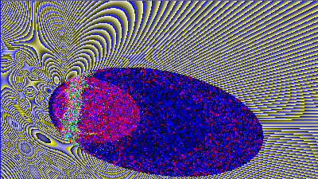
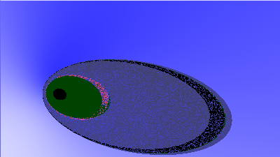
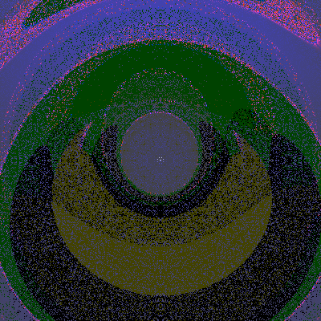
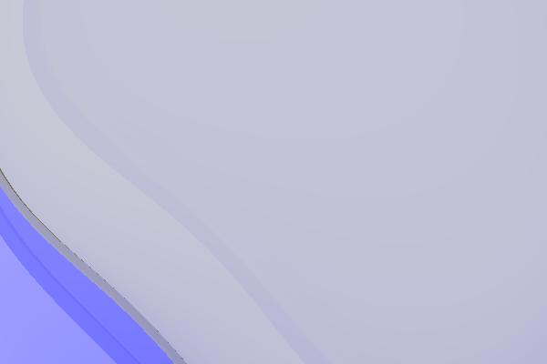
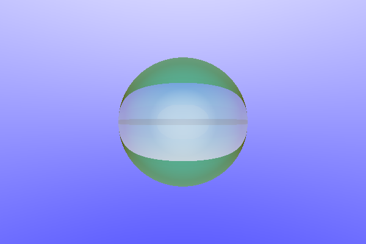
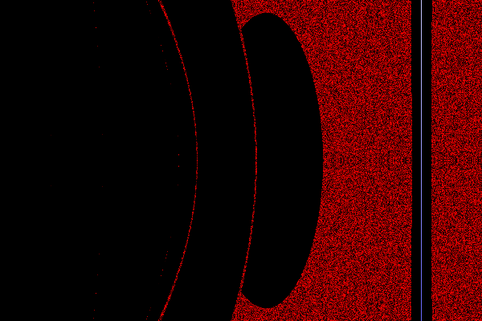
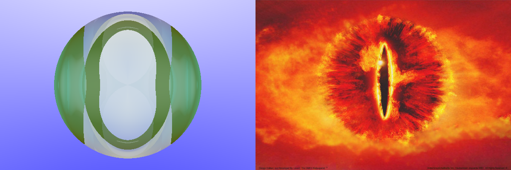

This is a timeline of in-between funny outputs of the raytraycer with some comments.

##### 06.09.

This... Beautiful result was caused by a switch from a 0-255 base color model to a 0-1 base color model and also some not entirely correct maths in the renderer.

##### 07.09

This artwork resulted from incorrect diffuse and specular lighting.

##### 08.09

Here we see what I call 'the void'. It's effectively not different from the previous picture, but now correctly centered on the sphere and much, much more beautiful.

##### 14.09

Caused by a faulty identity matrix (first column instead of diagonal was 1), this interesting looking picture feels like a summery wave.

This is what I call the "Glowy Pacman". It's likely caused by incorrect scaling computations in the kernel, but nevertheless just looks like a good base for some classic ghost-evading game.

##### 15.09

This feels just like hell. No matter that, it's just half-plane calculations gone wrong. Horribly wrong.

##### 16.09

From hell straight to the eye of Sauron.

